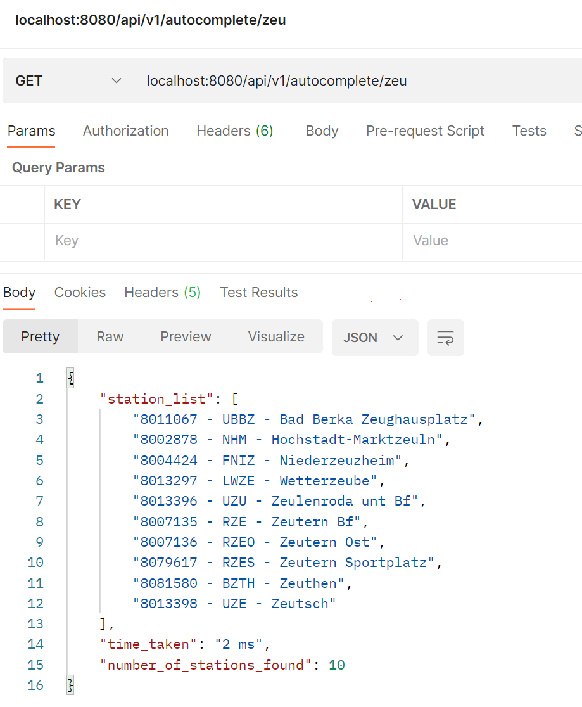

# Autocomplete Service

This is a miniature web service for autocompletion/search of german railway stations by their name.

The data is taken from the [open data](https://data.deutschebahn.com/dataset/data-haltestellen.html) provided by Deutsche Bahn

Example:

# Instalation

The web service is implemented in Java with Spring Boot framework.

- Download and Install [maven](https://maven.apache.org/download.cgi) to run it
- Download this project
- Run `mvn install` to check if the project is compiling and to install the dependencies
- Run `mvn spring-boot:run` from your console in the root folder of this project (same folder where the `pom.xml` file is)

# Test

Test this web service by sending GET HTTP requests to the `localhost:8080/v1/api/autocomplete/{searchKey}` endpoint.

`Searchkey` is a path parameter:

- It shouldn't contain numbers and can't be empty
- It may contain empty spaces between charachters.
